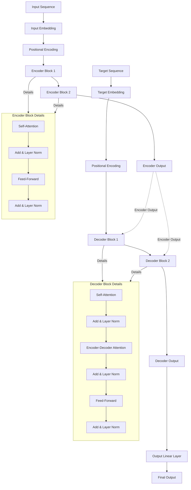

# MentiChat
Mental Health ChatBot with Transformer Model 
---

## Desain Arsitektur Transformer

```mermaid
graph TB
  %% Input and Encoder Section
  A[Input Sequence] --> B[Input Embedding]
  B --> C[Positional Encoding]
  C --> D[Encoder Block 1]
  D --> E[Encoder Block 2]
  E --> F[Encoder Output]

  %% Target and Decoder Section
  G[Target Sequence] --> H[Target Embedding]
  H --> I[Positional Encoding]
  I --> J[Decoder Block 1]
  J --> K[Decoder Block 2]
  K --> L[Decoder Output]

  %% Encoder-Decoder Attention Links
  F -.->|Encoder Output| J
  F -.->|Encoder Output| K

  %% Output Generation
  L --> M[Output Linear Layer]
  M --> N[Final Output]

  %% Subgraph for Encoder Block
  subgraph Encoder_Block [Encoder Block Details]
    direction TB
    E1[Self-Attention] --> E2[Add & Layer Norm]
    E2 --> E3[Feed-Forward]
    E3 --> E4[Add & Layer Norm]
  end
  D -->|Details| Encoder_Block
  E -->|Details| Encoder_Block

  %% Subgraph for Decoder Block
  subgraph Decoder_Block [Decoder Block Details]
    direction TB
    D1[Self-Attention] --> D2[Add & Layer Norm]
    D2 --> D3[Encoder-Decoder Attention]
    D3 --> D4[Add & Layer Norm]
    D4 --> D5[Feed-Forward]
    D5 --> D6[Add & Layer Norm]
  end
  J -->|Details| Decoder_Block
  K -->|Details| Decoder_Block
```

---
**Created by** : Kelompok 21 (Tugas Besar Deep Learning) 

**TA** : 2024 - 2025 