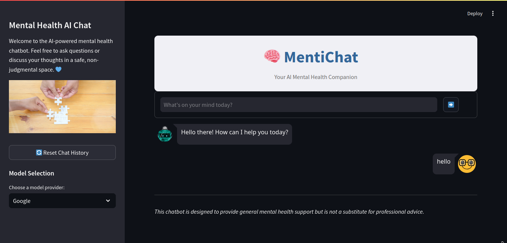
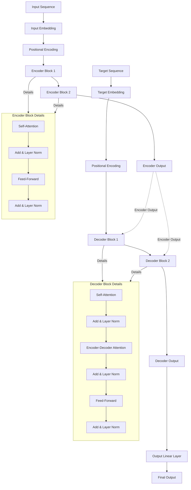

# 	&#128262; MentiChat
> Mental Health ChatBot with Transformer Model (Encoder-Decoder) with API Transport from [Hugging Face]("https://huggingface.co").

## **`Apps Overview`** 


> **Notes** : Proyek ini masih dalam tahapan pengembangan awal jadi jika ada kesalahan di dalam rekomendasi ataupun respons dari AI kami. Tolong Chat Developer kami untuk perbaikan lebih lanjut.

## &#9749; `Nama Anggota Kelompok`
> **Abdurrahman Al-atsary** (Sains Data) \
> **Gede Moena** (Sains Data) \
> **Wulan Sabina** (Sains Data) \
> **Putri Olivia Nuraeni** (Sains Data) \
> **Kiwit Novita Sari** (Sains Data) \
> **Tarisah** (Sains Data)


## &#10024; **`Latar Belakang`** 
Kesehatan mental adalah salah satu komponen esensial dari kesejahteraan individu, namun seringkali diabaikan dalam masyarakat. Di Indonesia, isu kesehatan mental masih dipandang sebelah mata, baik karena stigma sosial maupun kurangnya pemahaman masyarakat. Padahal, dampak kesehatan mental yang tidak tertangani dengan baik dapat memengaruhi berbagai aspek kehidupan, termasuk hubungan sosial, produktivitas kerja, hingga kualitas hidup secara keseluruhan.

## &#128204; `Tujuan`
Membangun sebuah model berbais transformer untuk membuat teman pribadi (*chat assistant*) untuk bisa membangun presepsi yang baik antar user dan bot sehingga kesehatan mental user dapat merasa tentram.  

## &#128194; `Dataset`
Dataset yang digunakan merupakan dataset yang dikumpulkan dari sumber terbuka (*open source*) yang ada di website Hugging Face dan Google Dataset yang berupa dataset yang terdiri dari 2 Fitur : *Context* (Tanya) dan *Response* (Jawab) tentang kesehatan mental. 

## &#129302; `Metode : Arsitektur Transformer (Encoder-Decoder)`



## `Hasil Evaluasi Model`
| **Aspek**                       | **Score**                                              |
|----------------------------------|-------------------------------------------------------|
|Human Evaluation*| 70%|
|BLEU Score**| 72.341%|
|METEOR Score**| 96%|

> **Notes**: \
> \* : Butuh Evaluasi beberapa orang dan beberapa skenario prompt untuk mengevaluasi hasilnya \
> \** : Butuh data dengan aspek besar untuk mengevaluasi perfoma dari model yang dibuat.

## &#127806; `Cara Penggunaan (Untuk Pengembangan)`
```sh
# Clone Github ini
git clone https://github.com/sains-data/MentiChat

# Buatlah sebuah environment python (Jika sudah memakai anaconda langsung install requirement yaa..)
pip install virtualenv
python -m venv venv

# Hidupkan environment python Anda
source venv/bin/activate # Linux and MacOS
.\venv\Scripts\activate  # Windows

# Install keseluruhan library yang dibutuhkan dalam pengembangan aplikasi ini 
pip install -r requirements.txt

# (Opsional) Silahkan buat model yang anda suka dan setting API model didalam file .env file ya
```


Silahkan jika ingin berminat untuk mengembangkan aplikasi dan model ini lebih lanjut..., Salam Developer &#128060;


## &#128059; `Cara Penggunaan (Untuk User Friendly)`
Kalian dapat mengunjungi link [berikut](https://mentichat.streamlit.app/) untuk interaksi dengan AI kami secara langsung. Sttt siapa lagi yang bisa kamu chat saat kamu lagi galau...&#128064;


## &#128172; `FAQ (Frequently Asked Question)`
Jika masih ada pertanyaan reach aja kami salah satu diatas ataupun bisa menghubungi email [Dev-Email](mailto:abdurrahman.121450128@student.itera.ac.id)

## &#128214; `Referensi`
[1] A. Vaswani, N. Shazeer, N. Parmar, J. Uszkoreit, L. Jones, A. N. Gomez, Ł. Kaiser, and I. Polosukhin, “Attention Is All You Need,” arXiv preprint arXiv:1706.03762, 2023. [Online]. Available: https://arxiv.org/abs/1706.03762


---
**Project Responsible** : Abdurrahman Al-atsary ([rachmanz](https://github.com/rachmanz)) \
**Created by** : Kelompok 21 (Tugas Besar Deep Learning) \
**Notion** : [Project Kelompok 21](https://soapy-risk-c88.notion.site/Kelompok-21-Proyek-Tugas-Besar-Deep-Learning-1338fd7a7e13807a926ed7624252c32e) \
**TA** : 2024 - 2025 
